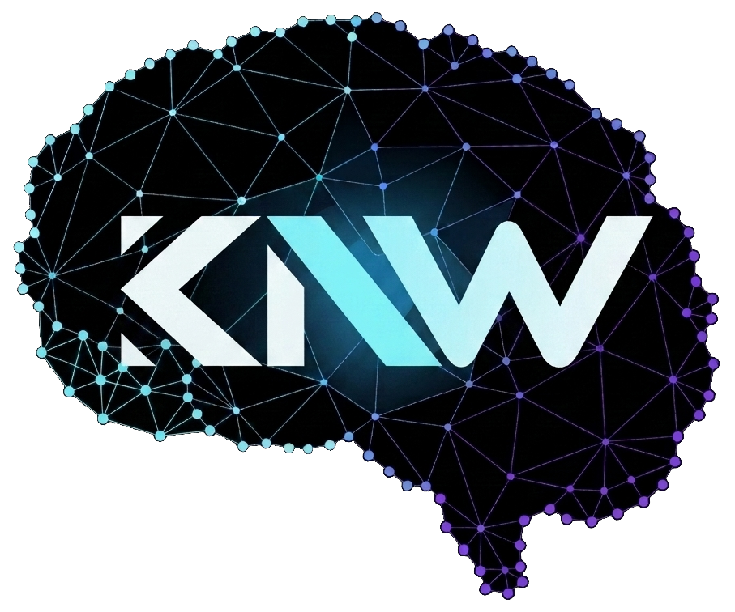
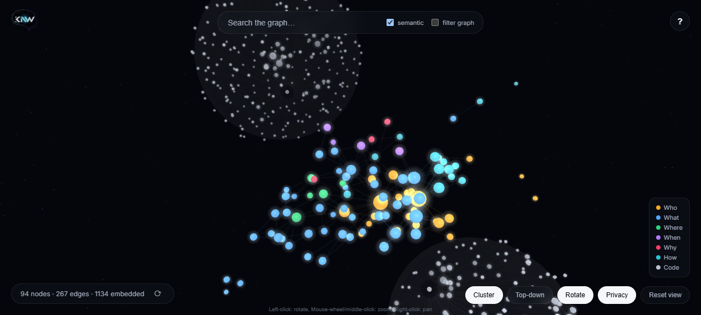
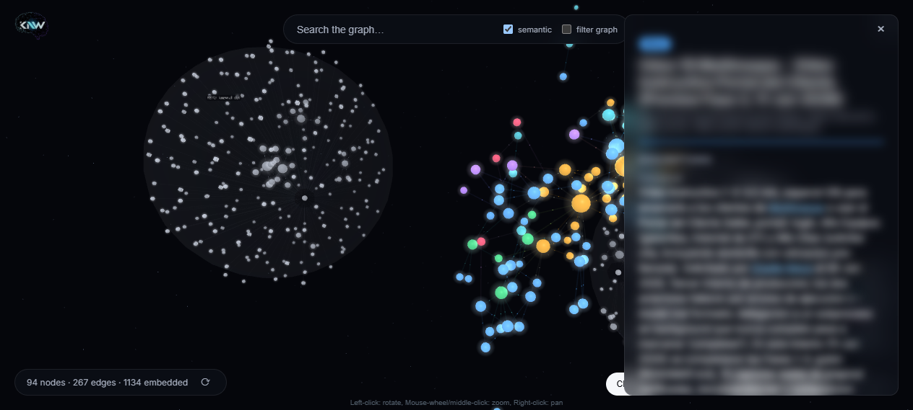

<p align="center">
  
</p>

<h1 align="center">Knewrall</h1>
<p align="center"><strong><em>Think, Connect, Understand, Remember. All of it!</em></strong></p>
<p align="center">Persistent, ownable memory &amp; a knowledge graph for your AI agents.</p>

<p align="center">
  <a href="LICENSE"></a>
  
  
</p>

## What it is

Knewrall is a **local-first, file-backed knowledge graph** that gives your AI agents a
durable, shared memory. It turns messy, unstructured input into a clean graph of
**Neurons** (nodes) connected by typed **Links** (edges), organized under six pillars —
**Who, What, Where, When, Why, How**. Everything is plain text on your disk: portable,
inspectable, versionable, and conflict-free under Git/Dropbox sync.

On top of that graph, Knewrall also **understands your codebases** (a full symbol
graph of functions, classes, and call relationships), finds things **by meaning, not
just by keyword** (hybrid literal + semantic vector search), and gives you a
**live 3D map** to fly through everything it knows.

## The problem it solves

AI agents are brilliant but amnesiac. Each session starts from zero — they re-learn the
same facts about your people, projects, and decisions, contradict earlier conclusions,
and lose everything you told them last week. Bolting a vector database onto them helps
with recall but leaves you with an opaque blob you can't read, edit, or trust.

Knewrall gives agents **memory you can actually see and own**: structured facts in
human-readable files, deduplicated and cross-linked, that survive across sessions and
across *different* agent tools. Because writes go through a validating layer, the graph
stays consistent instead of degrading into duplicate, half-formatted noise.

## Why use it / who it's for

Use Knewrall if you want your agents to **remember and build on what they learn** rather
than restart every time. It's for:

- **Power users of AI coding/agent tools** who want a single memory that follows them
  across Claude Code, Codex, Cline, Gemini, and others — not one silo per tool.
- **Knowledge workers & researchers** building a personal "second brain" that an agent
  maintains for them automatically.
- **Developers** who want their agent to reason over an actual codebase — symbol
  definitions, call graphs, imports — not just re-read files from scratch every time.
- **Anyone who distrusts black-box memory** and wants their data as portable plain text
  they can read, grep, edit, and back up.

Once installed, agents **automatically** ground their answers in the graph and save new
durable facts — no special prompt required each time.

## Highlights

| | |
|---|---|
| 🧠 **Knowledge graph** | Neurons (Who/What/Where/When/Why/How) linked by typed edges. Files are the source of truth; the index is a disposable, rebuildable cache. |
| 💻 **Code graphing** | Index any repo into a real symbol graph — definitions, callers, callees, imports — and link neurons straight to the code that implements them. |
| 🔎 **Semantic + literal search** | Hybrid retrieval blends exact-match search with vector KNN over embeddings, merged via Reciprocal Rank Fusion, so a query matches on *meaning* as well as substring. |
| 🪐 **3D Graph Viewer** | A local, self-contained explorer — fly through your graph, hover, expand, follow links, search — all in the browser, all offline. |
| 🧵 **Short-term memory** | `fold-run` captures verbose command output (test runs, builds, logs) to disk and hands your agent a short digest instead of the raw dump — retrievable on demand, auto-expiring, promotable to a durable Neuron if it turns out to matter. |
| 🔌 **Any agent harness** | One installer wires Claude Code, Codex, Gemini CLI, Cline, and anything else that reads a root instruction file. |
| 🔒 **Local-first & private** | Plain files on your disk. No account, no cloud dependency, no lock-in. Semantic search calls out only when *you* enable it. |

## Spotlight: the Knewrall Viewer

The fastest way to understand what's actually in your graph is to look at it. The
**Knewrall Viewer** is a local 3D explorer — nodes clustered and colored by pillar,
hover for a preview, click to expand the full neuron, follow any linked entity, and
search (literal or semantic) without ever leaving the graph.

<p align="center">
  
  <br><em>The graph in flight — nodes clustered and colored by pillar (Who/What/Where/When/Why/How), plus a code-symbol cluster.</em>
</p>

<p align="center">
  
  <br><em>Click any node to expand its full record — properties, links, and entity mentions. (Shown here with Privacy Mode on.)</em>
</p>

It ships with a built-in **Privacy Mode** for exactly this kind of screen-sharing or
demoing situation — one toggle blurs every panel, tooltip, and in-canvas label so you
can show off the *shape* of your graph without exposing its contents.

Runs as a single local process (Python/FastAPI backend + a pre-built TypeScript/three.js
frontend) — no Node.js required at runtime, nothing leaves your machine except an
optional query embed call when semantic search is on. Launch it with:

```bash
# Windows
knewrall\launch-viewer.bat

# Linux / macOS / Git Bash
./knewrall/launch-viewer.sh
```

Full architecture and dev-loop docs: [`viewer/README.md`](viewer/README.md).

## Quickstart

```bash
# 1. Put Knewrall in a knewrall/ subfolder of your agent workspace:
git clone https://github.com/your-repo/knewrall.git knewrall
pip install -r knewrall/requirements.txt

# 2. Wire it into the workspace (idempotent; safe to re-run):
python knewrall/install.py

# 3. Verify:
python knewrall/bin/knewrall.py stats
```

That's it. The installer writes pointer files for all supported harnesses
(`AGENTS.md`, `CLAUDE.md`, `GEMINI.md`, `.clinerules`) — each tool only reads its own,
so extras are harmless and you're covered if you switch tools later.
See [Install](#install) below for details and uninstall.

## Core Principles
- **Files are the source of truth.** The SQLite index is a disposable cache that can
  be rebuilt from the files in seconds.
- **Deterministic.** Identical data always serializes to byte-identical JSON (sorted
  keys + arrays), so syncing never produces merge conflicts.
- **Zero AI direct-write.** Agents never write files directly; they go through a
  validating Python middleware (`propose_node`, `propose_link`, ...).
- **The 6 pillars.** Everything is categorized as **Who, What, Where, When, Why, How**.

## Code graphing

Point Knewrall at a repo (`knewrall/projects/`, read-only — Knewrall never modifies
your code) and index it once to build a real symbol graph: definitions, call edges,
imports. From there you can search across function/class/method names and docstrings,
look up every definition of a symbol, trace what calls it and what it calls, and link
a neuron straight to the code that implements it — so an agent's understanding of
*why* a piece of code exists lives right next to the code itself.

```bash
python knewrall/bin/knewrall.py index-code
python knewrall/bin/knewrall.py code-search "authentication"
python knewrall/bin/knewrall.py code-callers src/auth.py::login
python knewrall/bin/knewrall.py link-code <neuron_id> <symbol_id> <repo>
```

## Semantic indexing

`search-graph --hybrid` and `recall()` (hybrid on by default) blend two retrieval
paths: an instant literal match over names/aliases/tags, and a k-nearest-neighbour
vector search over embeddings of neuron, note, and code-symbol content — merged with
Reciprocal Rank Fusion so a genuine literal hit and a genuine semantic hit both get a
fair shot at ranking near the top. Embeddings are cached by content hash and survive
index rebuilds; generate or refresh them with:

```bash
python knewrall/bin/knewrall.py embed
```

Full design notes, including the query-embedding latency problem and how it's
solved, are in [`docs/VECTOR_SEARCH.md`](docs/VECTOR_SEARCH.md).

### Configuring the embeddings model

Semantic search is entirely optional — literal search works with zero
configuration, and Knewrall degrades to it automatically if no embedding model
is set up or reachable. To enable semantic search, set the `embeddings` block
in `.knewrall/config.json`:

```json
"embeddings": {
  "provider": "openrouter",
  "model": "openai/text-embedding-3-small",
  "dim": 1536
}
```

- **`provider`** — `openrouter`, `openai`, or `google`, or point `base_url` at
  any other OpenAI-compatible embeddings endpoint.
- **`model`** — any embedding model your provider serves. If omitted, each
  provider falls back to a sensible default of its own.
- **`dim`** — the model's output dimension. Wrong or omitted, it self-corrects:
  Knewrall probes the real value on first use and writes it back for you.
- **API key** — always an environment variable, never `config.json`: a
  provider-specific `<KEY_ENV>_EMBEDS` var (e.g. `OPENROUTER_API_KEY_EMBEDS`)
  is checked first, then the generic `KNEWRALL_EMBED_API_KEY`, then the
  provider's shared key (`OPENROUTER_API_KEY` / `OPENAI_API_KEY` /
  `GOOGLE_API_KEY`) — so an install can use its own quota-isolated key without
  touching whatever other tools already have set.

Then populate the index with `embed` (above). Pick whichever model fits your
latency/quality/cost tradeoff — [`docs/VECTOR_SEARCH.md`](docs/VECTOR_SEARCH.md#embedding-model-comparison)
has comparative latency numbers across ten OpenRouter embedding models if
you want data points, but the release ships with no opinion baked in.

## Short-term memory (context folding)

Neurons are for durable facts. But agents also generate a lot of *transient* noise —
a full test-suite run, a long build log, a giant `git diff`, a file read that's 90%
boilerplate — and reading all of it back into context on every turn is how a session
runs out of room. The **Engram Layer** handles that other half of the memory problem:

```bash
python knewrall/bin/knewrall.py fold-run --label "pytest run" -- pytest -q tests/
```

Knewrall runs the command, keeps the full output on disk, and hands the agent back a
short digest — pass/fail counts, the failing lines, a retrieval key — instead of
12,000 raw lines of scrollback. Need more later? `unfold <key> --grep "AssertionError"`
pulls back exactly the part that matters, windowed and cheap. Nothing is ever thrown
away: the full output sits in `knewrall/engrams/`, expires automatically after a few
days, and can be promoted straight into a durable Neuron with `consolidate <key>` if
it turns out to be worth keeping.

It's per-machine and ephemeral by design — never synced, never indexed, gone by
default — layered on top of the same CLI you already use: `fold`, `fold-run`,
`unfold`, `folds`, `fold-scan`, `consolidate`, `fold-gc`. Full command reference in
[`INSTRUCTIONS.md`](INSTRUCTIONS.md#2-the-cli-your-only-tools).

## Directory Structure

| Folder | Owner | Purpose |
|---|---|---|
| [`neurons/`](neurons/README.md) | Knewrall | Structured `.json` nodes (+ `.md` companions), sharded by UUID prefix |
| [`notes/`](notes/README.md) | Knewrall | Distilled markdown notes, sharded by date `YYYY/MM` |
| [`media/`](media/README.md) | Knewrall | Multimedia attachments, sharded by date `YYYY/MM` |
| [`archive/`](archive/README.md) | Knewrall | Static, immutable file records, sharded by date `YYYY/MM` |
| [`engrams/`](engrams/README.md) | Knewrall | Ephemeral short-term memory (Engram Layer) — folded command output, per-machine, auto-expiring |
| [`workdesk/`](workdesk/README.md) | You + agents | Intake/scratch for raw input awaiting processing |
| [`projects/`](projects/README.md) | You | External repo clones — read-only source of knowledge; never written by KB scripts |
| [`viewer/`](viewer/README.md) | Knewrall | The 3D Graph Viewer (FastAPI backend + three.js frontend) |
| [`.knewrall/`](.knewrall/README.md) | Knewrall | Config manifest + ephemeral index |
| `schemas/` | — | JSON Schemas enforcing node structure |
| `src/` | — | Python engine (CRUD, indexer, code graph, embeddings, middleware, CLI) |
| `bin/` | — | Path-independent launcher (`knewrall.py`, plus `knewrall`/`knewrall.cmd` wrappers) |
| `templates/` | — | Files the installer drops into the host workspace (Claude Code hook + skill) |
| `branding/` | — | Project logo and visual identity assets |
| [`docs/`](docs/) | — | Deep-dive docs: vector search design, performance findings, embedding-model benchmark |
| `INSTRUCTIONS.md` | — | **Canonical, harness-agnostic agent operating instructions** |
| `install.py` | — | Wires Knewrall into an agent workspace (idempotent; supports `--uninstall`) |

**Write-ownership model:** `neurons/ notes/ media/ archive/` are written almost
exclusively by Knewrall. Put raw material you want processed in `workdesk/`; put code
you want agents to read in `projects/`.

## Install

Knewrall installs as a **`knewrall/` subfolder of your agent workspace** — it never
takes over your project's root. A small installer drops thin pointer files into the
root in the exact filenames each agent harness auto-loads, so memory and grounding
work automatically without per-prompt requests.

```bash
# From your agent workspace, put Knewrall in a knewrall/ subfolder:
git clone https://github.com/your-repo/knewrall.git knewrall
pip install -r knewrall/requirements.txt

# Wire it into the workspace (idempotent; safe to re-run):
python knewrall/install.py
```

The installer:
- Writes/updates a Knewrall block in `AGENTS.md`, `CLAUDE.md`, `GEMINI.md`, and
  `.clinerules` at the workspace root — preserving any existing content (only the
  region between the `KNEWRALL:BEGIN/END` markers is managed).
- Installs Claude Code hardening (`.claude/` SessionStart hook + skill) so the
  always-on behavior is enforced, not just suggested, where supported.
- Builds the searchable index.

Undo cleanly with `python knewrall/install.py --uninstall` (your own content and the
`knewrall/` data are left untouched).

### Harness compatibility

| Harness | Auto-loaded file | Wired by installer |
|---|---|---|
| Codex / OpenCode / Cursor / Antigravity | `AGENTS.md` | ✅ |
| Claude Code | `CLAUDE.md` (+ `.claude/` hook & skill) | ✅ |
| Gemini CLI | `GEMINI.md` | ✅ |
| Cline | `.clinerules` | ✅ |
| Agent Zero / Hermes / OpenClaw / other | *(framework-specific prompt dir)* | Manual — point the agent's system/base prompt at [`knewrall/INSTRUCTIONS.md`](INSTRUCTIONS.md) |

For any harness without a standard instruction file, set its system/base prompt to the
contents of [`INSTRUCTIONS.md`](INSTRUCTIONS.md) — that single file is the canonical
operating contract everything else points to.

## Usage

### For AI agents
Agents follow [`INSTRUCTIONS.md`](INSTRUCTIONS.md) (loaded automatically via the root
pointer files) and operate **only** through the path-independent launcher, which works
from any working directory:

```bash
python knewrall/bin/knewrall.py search-graph "query"
python knewrall/bin/knewrall.py propose-node payload.json
python knewrall/bin/knewrall.py propose-link <source_id> <target_id> <predicate>
python knewrall/bin/knewrall.py update-node <node_id> --json '{"properties": {"key": "corrected value"}}'
```

Two behaviors are always in effect with no user request: **ground** from the graph
before acting, and **save** durable new facts as Neurons.

### For humans
- Drop raw input into [`workdesk/`](workdesk/README.md) for the system to process.
- Search and inspect the graph:
  ```bash
  python knewrall/bin/knewrall.py search "query"
  python knewrall/bin/knewrall.py stats
  ```
- Or just open the [**Viewer**](#spotlight-the-knewrall-viewer) and fly through it.

> Developers working inside the repo itself can still use `python -m src.cli ...` from
> the repo root; the `bin/knewrall.py` launcher is the portable form for installed
> workspaces. Both honor the `KNEWRALL_ROOT` environment variable as an explicit
> root override.

## Documentation

- [`INSTRUCTIONS.md`](INSTRUCTIONS.md) — canonical agent operating instructions and full CLI reference.
- [`docs/VECTOR_SEARCH.md`](docs/VECTOR_SEARCH.md) — hybrid semantic + literal retrieval design.
- [`docs/PERF_FINDINGS.md`](docs/PERF_FINDINGS.md) — the embedding-latency investigation that shaped it.
- [`docs/EMBEDDING_MODEL_BENCHMARK.md`](docs/EMBEDDING_MODEL_BENCHMARK.md) — the 10-model benchmark behind the default embedding model.
- [`docs/system_prompt.md`](docs/system_prompt.md) — pointer for harnesses that take a raw system prompt.

## License

Knewrall is released under the [Apache License 2.0](LICENSE) — free to use, modify,
and build on, including commercially, provided you keep attribution and flag what you
changed. See [`NOTICE`](NOTICE) for the copyright notice.

This repo is the free, open **core**. A separate **Knewrall Pro / Teams** edition —
with additional features for collaborative and organizational use — is developed under a
commercial license; the core here stays Apache 2.0.

---

<p align="center">
  <strong>Give your agents a memory that outlasts the session.</strong><br>
  <a href="#quickstart">Get started in three commands →</a>
</p>

<p align="center">
  Developed by <a href="https://abchaind.com">ABChainD Systems</a>
</p>
